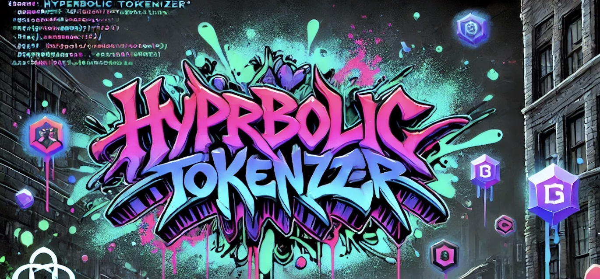

# Hyperbolic Tokenization Framework

This repository contains a complete implementation of the Hyperbolic Tokenization framework—a novel approach to subword tokenization that leverages hyperbolic geometry to guide the token merging process.

## 📋 Overview

Traditional subword tokenization methods like BPE, WordPiece, and Unigram rely on frequency-based or likelihood-based merge strategies in Euclidean space. The Hyperbolic Tokenization framework introduces a fundamentally different approach by:

1. Embedding tokens in hyperbolic space (Lorentz model)
2. Using hyperbolic distance to guide merge decisions
3. Preserving hierarchical relationships in the vocabulary
4. Enabling improved downstream task performance

## 🚀 Getting Started

### Prerequisites

- Python 3.8+
- PyTorch 1.13+
- CUDA (optional, for GPU acceleration)

### Installation

```bash
# Clone the repository
git clone https://github.com/yourusername/HypTokenizer.git
cd HypTokenizer

# Create a virtual environment
python3 -m venv venv
source venv/bin/activate

# Install dependencies
pip install -r requirements.txt
```

## 📊 Project Structure

```
HypTokenizer/
├── data/                   # Data storage
│   ├── raw/                # Raw downloaded datasets
│   └── processed/          # Processed datasets
├── tokenizer/              # Tokenization algorithms
│   └── hyperbolic_merge.py # Hyperbolic tokenizer implementation
├── embedding/              # Hyperbolic embedding modules
│   ├── lorentz_model.py    # Lorentz model operations
│   └── poincare_ball.py    # Poincaré ball operations
├── multimodal/             # Multimodal learning components
│   └── contrastive_loss.py # Hyperbolic contrastive loss
├── scripts/                # Training and evaluation scripts
├── experiments/            # Experiment configurations
├── notebooks/              # Analysis notebooks
├── results/                # Experimental results
└── tests/                  # Unit tests
```

## 🛠️ Usage

### Data Preprocessing

```bash
# Build WordNet graph
python scripts/build_wordnet_graph.py

# Preprocess Wikipedia data
python scripts/preprocess_wiki.py --input_dir data/raw/wiki --output_file data/processed/wiki/wiki.txt
```

### Training Tokenizers

```bash
# Train baseline tokenizers (BPE, WordPiece, Unigram)
# For each method ∈ {bpe, wordpiece, unigram} and each V ∈ {10000, 20000, 50000, 100000}

# Train hyperbolic tokenizer
python scripts/train_hyperbolic_tokenizer.py \
    --vocab_path data/processed/wiki/vocab_initial.txt \
    --output_dir results/hyperbolic/v50000 \
    --embedding_dim 50 \
    --target_vocab_size 50000
```

### Downstream Task Evaluation

```bash
# Train and evaluate on NLP tasks
python scripts/train_nlp_tasks.py \
    --method hyperbolic \
    --vocab_size 50000 \
    --model_path results/hyperbolic/v50000

# Train and evaluate on cross-modal retrieval
python scripts/train_retrieval.py \
    --output_dir results/hyperbolic/v50000/retrieval
```

### Evaluation and Analysis

```bash
# Evaluate hierarchy distortion
python scripts/eval_hierarchy.py \
    --embeddings_path results/hyperbolic/v50000/embeddings.pt \
    --vocab_path results/hyperbolic/v50000/vocab.json

# Benchmark efficiency
python scripts/benchmark_efficiency.py

# Generate visualizations and analyses
python notebooks/analysis.py
```

## 📝 Key Components

### Hyperbolic Embedding

The framework implements the Lorentz model of hyperbolic geometry, with operations including:
- Minkowski dot product and norm
- Exponential and logarithmic maps
- Parallel transport
- Riemannian gradient

### Hyperbolic Tokenizer

The `HyperbolicTokenizer` class implements the core tokenization algorithm:
- Initialized with character-level tokens and embeddings
- Iteratively merges tokens based on hyperbolic distance
- Uses hyperbolic midpoint calculation for new token embeddings
- Implements standard tokenize/encode/decode interface

### Multimodal Learning

The framework includes components for multimodal learning in hyperbolic space:
- Hyperbolic contrastive loss
- Two-tower architecture for text-image retrieval
- Projection layers for mapping to hyperbolic space

## 📊 Results

After running the evaluation pipeline, you can analyze the results in `results/figures/`:
- Distortion vs. vocabulary size
- Perplexity vs. distortion
- Comparative metrics on downstream tasks
- Efficiency benchmarks

## 🔬 Tests

Run the test suite to verify the implementation:

```bash
# Run all tests
python -m unittest discover tests

# Run specific test
python -m unittest tests.test_lorentz_model
```

## 📚 References

- Dhingra, B., Faruqui, M., et al. (2018). Embedding Text in Hyperbolic Spaces.
- Nickel, M., & Kiela, D. (2017). Poincaré Embeddings for Learning Hierarchical Representations.
- Ganea, O., Bécigneul, G., et al. (2018). Hyperbolic Neural Networks.
- Tifrea, A., Bécigneul, G., et al. (2018). Poincaré GloVe: Hyperbolic Word Embeddings.

## 📄 License

This project is licensed under the MIT License - see the LICENSE file for details.

## 👥 Contributing

Contributions are welcome! Please feel free to submit a Pull Request.
